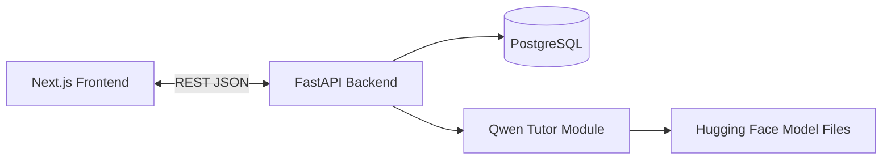

# Architecture

## Overview
The system is a web-based math tutor prototype with a Next.js frontend, FastAPI backend, PostgreSQL database, and a local Qwen-based tutor module. The frontend communicates with the backend via REST APIs. The backend stores chat history and delegates math responses to the tutor module.

## Responsibilities

### Frontend (Next.js)
- User registration and login flows.
- Chat workspace with message input and message history.
- Folder management and chat organization.
- Profile view, password change modal, and account deletion flow.
- Math rendering of tutor responses using KaTeX.

### Backend (FastAPI)
- Auth endpoints and JWT creation.
- Chat lifecycle: start chat, add follow-up messages, list and delete chats.
- Folder CRUD operations.
- Persist chat messages in PostgreSQL.
- Invoke the Qwen tutor module and return responses to the frontend.

### Database (PostgreSQL)
- Stores users, chats, chat messages, and folders.
- Enforces relationships via foreign keys.
- Tables are created at backend startup (no migrations).

### AI Tutor Module (Qwen)
- Loads the configured Qwen model from Hugging Face.
- Applies system prompt guardrails to enforce math-only tutoring and short hints.
- Returns categorized responses with completion hints.

## Key Flows

### Authentication Flow
1) User registers or logs in.
2) Backend issues a JWT.
3) Frontend stores the token in localStorage and attaches it to requests.
4) Backend validates the token on protected routes.

### Chat Flow
1) User starts a chat with POST /api/qa/chats/start.
2) Backend creates a Chat and a user ChatMessage.
3) Backend calls the Qwen tutor and stores the assistant ChatMessage.
4) Follow-up messages use POST /api/qa/chats/{chat_id}/messages.

### Folder and Saved Conversation Flow
1) User creates a folder via POST /api/qa/folders.
2) User moves a chat via PATCH /api/qa/chats/{chat_id}/folder.
3) Deleting a folder deletes its chats (cascade).

### Error Handling (High Level)
- Auth errors return 401; the frontend redirects to login.
- Not found errors return 404 (missing chats or folders).
- Tutor load failures return a normal response with an error message in the reply.

## System Diagram (Mermaid)

